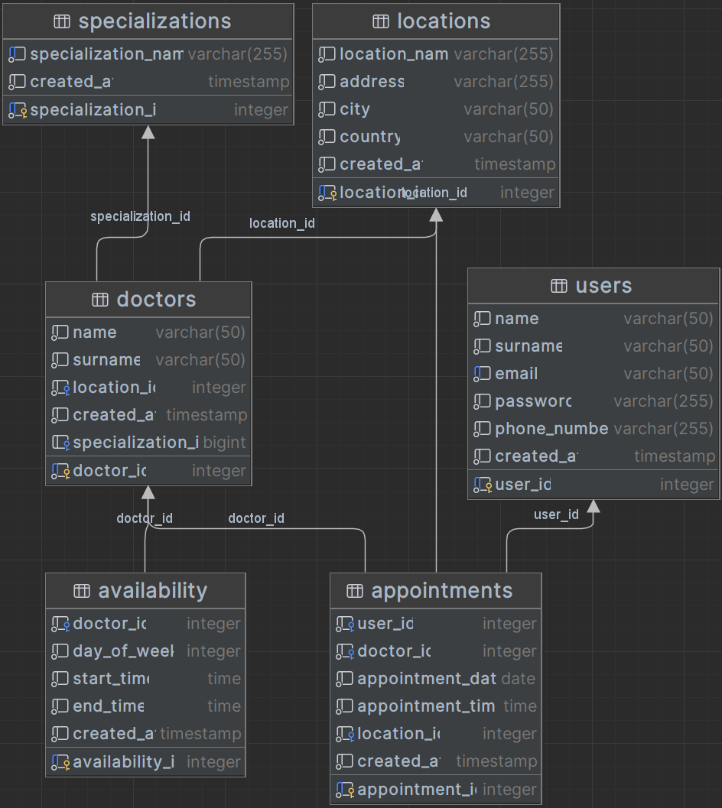
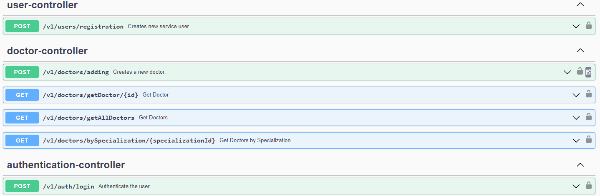
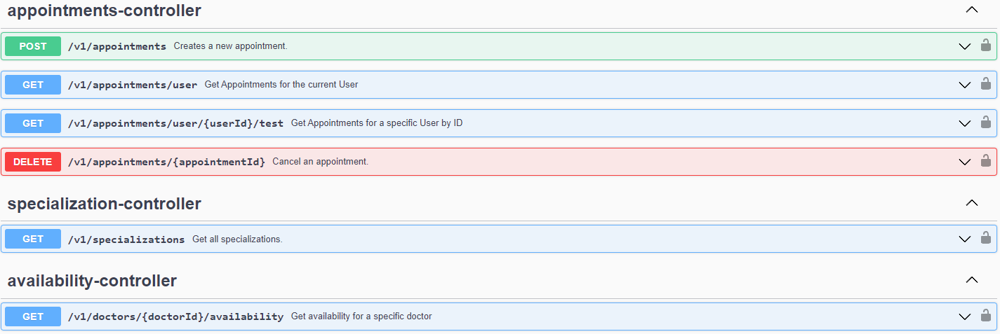

# Med-Hub

## Introduction

Med-Hub is a web application designed for registering and managing medical visits. It provides a platform for users to register, log in, add doctors to the application, book appointments, view their schedules, and cancel appointments.

## Table of Contents

- [Installation](#installation)
- [Usage and Features](#usage-and-features)
- [Dependencies](#dependencies)
- [Contact](#contact)
- [Database](#database)
- [Swagger API Endpoints](#swagger-api-endpoints)

## Installation

To install Med-Hub, follow these steps:

1. Clone the repository:
```
   git clone https://github.com/your-username/GraveManager.git 
```
2. Set up the infrastructure with a local PostgreSQL Database using Docker:

- Run this command in the root folder of the project.
```
docker-compose up
```
3. Start the backend application:
- Navigate to the `backend` directory.
- Run the command:
```
./gradlew clean build
```
```
./gradlew bootRun
```
3. Start the frontend application:
- Navigate to the `frontend/med-hub` directory.
- Run the following command:
  ```
  npm start
  ```
- Open http://localhost:3000 to view in the browser.
## Usage and Features

#### Med-Hub offers several key features, including:

- **User Registration and Login**: Secure access to the application.
- **Doctor Management**: Add doctors to the application for appointment scheduling.
- **Appointment Booking**: Users can book appointments with available doctors.
- **Schedule Viewing**: Users can view their upcoming appointments.
- **Appointment Cancellation**: Offers the flexibility to cancel appointments.

## Dependencies

#### Med-Hub is built using a variety of technologies and frameworks:

- Java 17
- Spring Boot 3
- Spring Framework 6
- Gradle
- PostgreSQL
- Liquibase
- Docker
- React.js
- HTML
- CSS

#### Ensure you have these technologies installed and properly configured on your system to run Med-Hub!

## Database

The project employs Liquibase for database management, providing easy and secure tools for database creation, management, and migration. Utilizing infrastructure as code, it ensures control over database structure changes, using XML format for organized database schema management.

#### Entity Realationship Diagram (ERD):


## Swagger API Endpoints



## Contact
Created by @liseeek - contact me!
- Email: lisszymon.contact@gmail.com
- Linkedin: https://www.linkedin.com/in/lis-szymon/