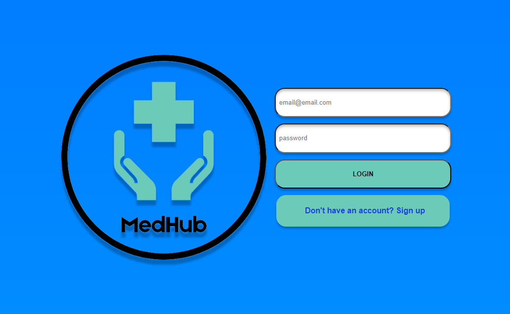
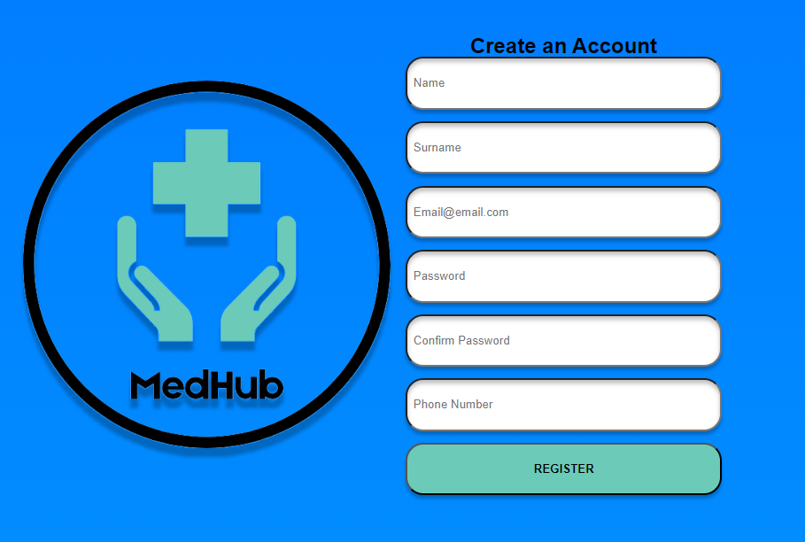
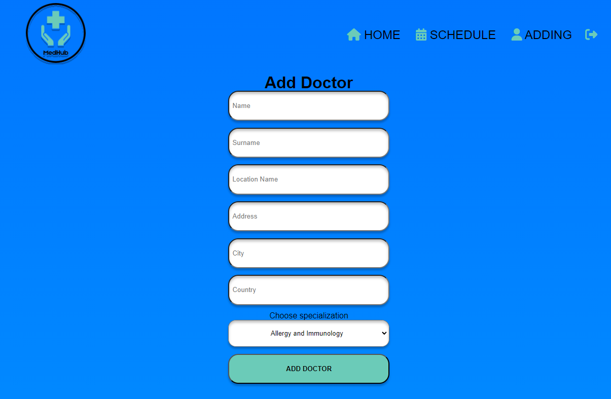
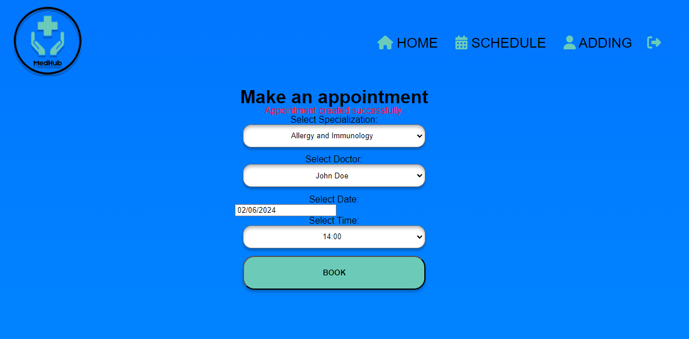
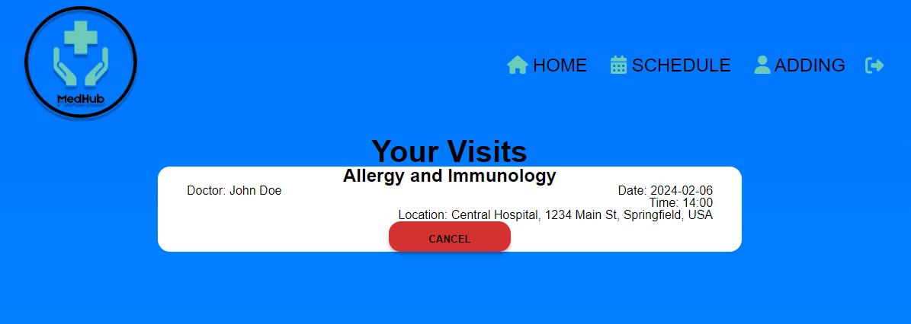

# MedHub Frontend 
In the project directory, you can run:

```
npm install
```
Install project packages.
```
npm start
```
Run the app!

Open http://localhost:3000 to view it in the browser.

## Views

### Login



### Register



### Mainpage


### Adding



### Booking



### Schedule 


